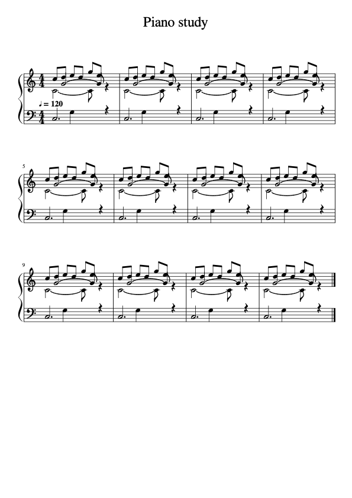

# V12: quieter bass and clearer sheet music

V12 adds a trained wrong-pitch rejection stage after V10 bass verification and
V11 hold repair. It targets unsupported bass notes in balanced Full-song piano
arrangements. The Basic Pitch, Demucs, solo-piano, vocal and other-accompaniment
models retain their existing weights. No user uploads were transcribed, used for
training, or regenerated during this release.

## Training and selection

The completed expanded batch adds 48 licensed BabySlakh/Demucs MP3 crops at
30/60/90 seconds (36 train, 12 validation), and 80 original bass-generator seeds
261801–261880 (64 train, 16 validation). Source-group partitions remain fixed.
All crops from a composition/performer stay in their original partition. The
full corpus has 459 training, 122 validation and 92 consumed regression clips.
The underlying labeled sources are BabySlakh and GuitarSet, both CC BY 4.0,
plus project-authored signals. Attribution accompanies the shipped arrays.

Fitting uses 26,264 supervised V11-retained events: 20,831 protected positives
and 5,433 unsupported candidates. Every annotated pitch overlap beyond the
existing 1e-6-second coverage tolerance receives KEEP supervision, including
short partially supported continuations. Matched attacks and offsets are also
protected. Inference features contain no annotations, recording names or
absolute pitch.

Two predeclared profiles fit four boosting heads with a 600-tree limit,
learning rate .04, positive weights 6/12 and guardian weight 20. Checkpoints at
100/200/400/500/600 trees and threshold grids were declared before fitting.
Validation alone selected the guarded 200-tree pair with strict .05/.1 veto
thresholds. The failed prior batch remains withheld; neither its consumed
regressions nor this release's fresh recordings were used for fitting, model
selection or threshold adjustment. Earlier failed evidence is retained.

The 74-feature context head uses acoustic evidence, observed pitch-relative
neighbors and freshly recomputed V10 confidence. Its 28-feature guardian uses
base acoustics and those confidences. Features are recomputed on the **actual
post-V11 merged intervals**. Reusing evidence from shorter pre-merge notes would
judge the wrong interval.

## Measured preservation

| Cohort | Matched attacks, unchanged | False notes before → after |
| --- | ---: | ---: |
| 122 validation clips | 4,648 | 3,791 → 3,763 |
| 92 consumed regression clips | 1,765 | 1,410 → 1,322 |
| 32 first-pass original MP3 seeds | 579 | 159 → 151 |

Every recording preserves its previously matched attacks, offset-aware hold
matches and all supplied reference pitch-time coverage. No recording gains
false notes. First-pass F1 improves .83249 → .83731; recall stays .88668.
Expanded validation F1 improves .53129 → .53214 with recall .51314. This small
improvement **does not establish accurate transcription of arbitrary songs**.
The primary detector still misses many notes on the licensed validation corpus.
Shared compositions, synthetic timbre limits and upstream pretraining overlap
are not ruled out. The 32 unseen seeds come from the existing generator, not
independent human performances. They are now consumed regression and cannot be
used as fresh evidence or fitted into a later release.

## Production and verification

The new stage runs only after V10 filtering and V11 hold repair, on bass pitches
21–59 at least 2.5 seconds inside each bounded inference window. Both heads must
reject; either-head support or threshold equality vetoes deletion. Retained
notes preserve object identity, source part, pitch, start, end and velocity.
It cannot transpose notes, invent notes, change rhythm or revive prior rejects.
Metadata distinguishes V10 rejections, V11 merged boundaries and residual
rejections. Asset checksums, feature contracts and thresholds are validated at
load time; health readiness requires both new arrays.

Portable/runtime probability and feature parity passed all 705 cached recordings,
covering 43,831 V11-retained events. Maximum probability error was exactly zero
at 1e-12 tolerance. The 642 rejected events include fitting examples, so that
total is **not independent accuracy evidence**. Eight native routing cases
matched frozen sklearn through the entire production bass route, using real
Basic Pitch/audio features, holds, repetitions, octave notes, licensed Slakh,
two observed residual deletions, 32-second context and subframe audio.

The notation update hides secondary-voice rests while retaining their MusicXML
rhythmic positions, assigns consistent stem directions, increases staff size
and separation, and breaks systems before measures become crowded. It does not
remove pitched score events or change quantization, note duration, attacks,
velocity, ties or playback. PDF/SVG/seek positions share the same layout. A
12-bar project-authored overlap fixture preserves all 120 audible notes and
84 seek positions exactly; before/after renderings were visually checked.
The website gives the score the full workspace width and places downloads below
it. The following is the rendered project-authored layout fixture:

 Playback following, seeking and zoom controls remain available.

436 backend/training tests, 26 frontend tests and all six native pipeline
integrations passed. Frontend and backend builds succeeded. The idle-queue
deployment is ready; live source and asset hashes match the checked release,
and the existing seven completed jobs remain unchanged. The browser opens
the saved score with the new full-width workspace and no console errors.

Release checks and deployment details are recorded in release-checks.json under
training/results/bass-residual-expanded-v3. Historical V11 training helpers
intentionally reject V12 routing. Pre-release routing and notation snapshots
are archived with this release; reproduce fitting from those historical sources.
**Future experiments need a V12 baseline with all three stages and the real
retained intervals. A V10 or V11-only baseline cannot demonstrate improvement
against the updated website.** Existing saved scores remain unchanged; new
uploads receive the model and engraving changes.

Frozen checkpoint SHA256:
2230f5804e22a0bc0e94a906dd4747eed039d929c3da39e3e5de8619274f4afb.
Portable arrays:
0362480f1210e4f7220fdd6984cee71260fd0145f87559710789bdfabc319988 and
cc09f098276d7c31cbafef90fdf6f18f42424a7b4159270bc2e3c332372b9dfb.
Witnesses: training/results/bass-residual-expanded-v3; first-pass acquisition:
training/results/bass-residual-fresh-v1.
